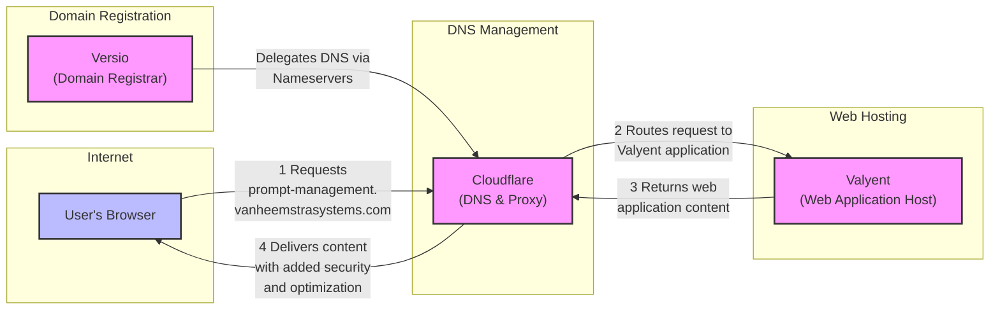

# 200 - Diagrams

A diagram showing the DNS and routing flow for your setup using Mermaid.​​​​​​​​​​​​​​​​

Let me explain the key components and flow:

1. **Domain Registration (Versio)**:
   - Maintains the domain registration for vanheemstrasystems.com
   - Delegates DNS authority to Cloudflare via nameserver settings

2. **DNS & Proxy (Cloudflare)**:
   - Manages DNS records including the prompt-management subdomain
   - Provides security, caching, and optimization
   - Routes traffic to Valyent
   - Acts as the "broker" in your setup

3. **Web Host (Valyent)**:
   - Hosts the actual web application
   - Receives traffic via Cloudflare's proxy

4. **Request Flow**:
   - User requests prompt-management.vanheemstrasystems.com
   - Request goes through Cloudflare's global network
   - Cloudflare forwards to Valyent
   - Response returns through Cloudflare to user

This setup gives you:
- Centralized DNS management
- Easy host changes if needed
- Added security and performance from Cloudflare
- Clean separation of concerns between registration, DNS, and hosting

